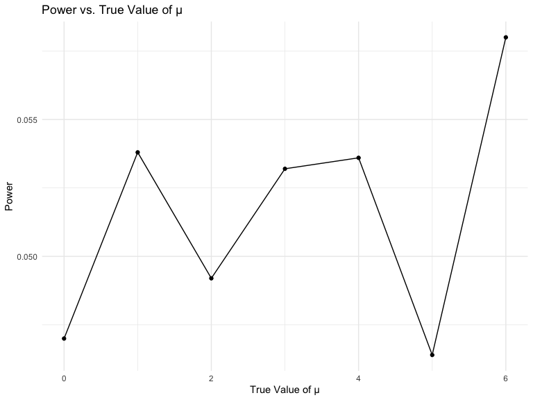

HW 5 Data Science
================
Victoria Mello (vsm2118)
November 13, 2023

## Problem 1

## Problem 2

``` r
 # Step 1: Get all file names
file_names <- list.files(path = "./data", pattern = ".csv", full.names = TRUE)

# Step 2: Use purrr::map to read in data for each subject
data_list <- map(file_names, ~read_csv(.x) %>%
                   mutate(subject_id = gsub("[^0-9]", "", .x),
                          arm = ifelse(grepl("con", .x), "control", "experimental")))
```

    ## Rows: 1 Columns: 8
    ## ── Column specification ────────────────────────────────────────────────────────
    ## Delimiter: ","
    ## dbl (8): week_1, week_2, week_3, week_4, week_5, week_6, week_7, week_8
    ## 
    ## ℹ Use `spec()` to retrieve the full column specification for this data.
    ## ℹ Specify the column types or set `show_col_types = FALSE` to quiet this message.
    ## Rows: 1 Columns: 8
    ## ── Column specification ────────────────────────────────────────────────────────
    ## Delimiter: ","
    ## dbl (8): week_1, week_2, week_3, week_4, week_5, week_6, week_7, week_8
    ## 
    ## ℹ Use `spec()` to retrieve the full column specification for this data.
    ## ℹ Specify the column types or set `show_col_types = FALSE` to quiet this message.
    ## Rows: 1 Columns: 8
    ## ── Column specification ────────────────────────────────────────────────────────
    ## Delimiter: ","
    ## dbl (8): week_1, week_2, week_3, week_4, week_5, week_6, week_7, week_8
    ## 
    ## ℹ Use `spec()` to retrieve the full column specification for this data.
    ## ℹ Specify the column types or set `show_col_types = FALSE` to quiet this message.
    ## Rows: 1 Columns: 8
    ## ── Column specification ────────────────────────────────────────────────────────
    ## Delimiter: ","
    ## dbl (8): week_1, week_2, week_3, week_4, week_5, week_6, week_7, week_8
    ## 
    ## ℹ Use `spec()` to retrieve the full column specification for this data.
    ## ℹ Specify the column types or set `show_col_types = FALSE` to quiet this message.
    ## Rows: 1 Columns: 8
    ## ── Column specification ────────────────────────────────────────────────────────
    ## Delimiter: ","
    ## dbl (8): week_1, week_2, week_3, week_4, week_5, week_6, week_7, week_8
    ## 
    ## ℹ Use `spec()` to retrieve the full column specification for this data.
    ## ℹ Specify the column types or set `show_col_types = FALSE` to quiet this message.
    ## Rows: 1 Columns: 8
    ## ── Column specification ────────────────────────────────────────────────────────
    ## Delimiter: ","
    ## dbl (8): week_1, week_2, week_3, week_4, week_5, week_6, week_7, week_8
    ## 
    ## ℹ Use `spec()` to retrieve the full column specification for this data.
    ## ℹ Specify the column types or set `show_col_types = FALSE` to quiet this message.
    ## Rows: 1 Columns: 8
    ## ── Column specification ────────────────────────────────────────────────────────
    ## Delimiter: ","
    ## dbl (8): week_1, week_2, week_3, week_4, week_5, week_6, week_7, week_8
    ## 
    ## ℹ Use `spec()` to retrieve the full column specification for this data.
    ## ℹ Specify the column types or set `show_col_types = FALSE` to quiet this message.
    ## Rows: 1 Columns: 8
    ## ── Column specification ────────────────────────────────────────────────────────
    ## Delimiter: ","
    ## dbl (8): week_1, week_2, week_3, week_4, week_5, week_6, week_7, week_8
    ## 
    ## ℹ Use `spec()` to retrieve the full column specification for this data.
    ## ℹ Specify the column types or set `show_col_types = FALSE` to quiet this message.
    ## Rows: 1 Columns: 8
    ## ── Column specification ────────────────────────────────────────────────────────
    ## Delimiter: ","
    ## dbl (8): week_1, week_2, week_3, week_4, week_5, week_6, week_7, week_8
    ## 
    ## ℹ Use `spec()` to retrieve the full column specification for this data.
    ## ℹ Specify the column types or set `show_col_types = FALSE` to quiet this message.
    ## Rows: 1 Columns: 8
    ## ── Column specification ────────────────────────────────────────────────────────
    ## Delimiter: ","
    ## dbl (8): week_1, week_2, week_3, week_4, week_5, week_6, week_7, week_8
    ## 
    ## ℹ Use `spec()` to retrieve the full column specification for this data.
    ## ℹ Specify the column types or set `show_col_types = FALSE` to quiet this message.
    ## Rows: 1 Columns: 8
    ## ── Column specification ────────────────────────────────────────────────────────
    ## Delimiter: ","
    ## dbl (8): week_1, week_2, week_3, week_4, week_5, week_6, week_7, week_8
    ## 
    ## ℹ Use `spec()` to retrieve the full column specification for this data.
    ## ℹ Specify the column types or set `show_col_types = FALSE` to quiet this message.
    ## Rows: 1 Columns: 8
    ## ── Column specification ────────────────────────────────────────────────────────
    ## Delimiter: ","
    ## dbl (8): week_1, week_2, week_3, week_4, week_5, week_6, week_7, week_8
    ## 
    ## ℹ Use `spec()` to retrieve the full column specification for this data.
    ## ℹ Specify the column types or set `show_col_types = FALSE` to quiet this message.
    ## Rows: 1 Columns: 8
    ## ── Column specification ────────────────────────────────────────────────────────
    ## Delimiter: ","
    ## dbl (8): week_1, week_2, week_3, week_4, week_5, week_6, week_7, week_8
    ## 
    ## ℹ Use `spec()` to retrieve the full column specification for this data.
    ## ℹ Specify the column types or set `show_col_types = FALSE` to quiet this message.
    ## Rows: 1 Columns: 8
    ## ── Column specification ────────────────────────────────────────────────────────
    ## Delimiter: ","
    ## dbl (8): week_1, week_2, week_3, week_4, week_5, week_6, week_7, week_8
    ## 
    ## ℹ Use `spec()` to retrieve the full column specification for this data.
    ## ℹ Specify the column types or set `show_col_types = FALSE` to quiet this message.
    ## Rows: 1 Columns: 8
    ## ── Column specification ────────────────────────────────────────────────────────
    ## Delimiter: ","
    ## dbl (8): week_1, week_2, week_3, week_4, week_5, week_6, week_7, week_8
    ## 
    ## ℹ Use `spec()` to retrieve the full column specification for this data.
    ## ℹ Specify the column types or set `show_col_types = FALSE` to quiet this message.
    ## Rows: 1 Columns: 8
    ## ── Column specification ────────────────────────────────────────────────────────
    ## Delimiter: ","
    ## dbl (8): week_1, week_2, week_3, week_4, week_5, week_6, week_7, week_8
    ## 
    ## ℹ Use `spec()` to retrieve the full column specification for this data.
    ## ℹ Specify the column types or set `show_col_types = FALSE` to quiet this message.
    ## Rows: 1 Columns: 8
    ## ── Column specification ────────────────────────────────────────────────────────
    ## Delimiter: ","
    ## dbl (8): week_1, week_2, week_3, week_4, week_5, week_6, week_7, week_8
    ## 
    ## ℹ Use `spec()` to retrieve the full column specification for this data.
    ## ℹ Specify the column types or set `show_col_types = FALSE` to quiet this message.
    ## Rows: 1 Columns: 8
    ## ── Column specification ────────────────────────────────────────────────────────
    ## Delimiter: ","
    ## dbl (8): week_1, week_2, week_3, week_4, week_5, week_6, week_7, week_8
    ## 
    ## ℹ Use `spec()` to retrieve the full column specification for this data.
    ## ℹ Specify the column types or set `show_col_types = FALSE` to quiet this message.
    ## Rows: 1 Columns: 8
    ## ── Column specification ────────────────────────────────────────────────────────
    ## Delimiter: ","
    ## dbl (8): week_1, week_2, week_3, week_4, week_5, week_6, week_7, week_8
    ## 
    ## ℹ Use `spec()` to retrieve the full column specification for this data.
    ## ℹ Specify the column types or set `show_col_types = FALSE` to quiet this message.
    ## Rows: 1 Columns: 8
    ## ── Column specification ────────────────────────────────────────────────────────
    ## Delimiter: ","
    ## dbl (8): week_1, week_2, week_3, week_4, week_5, week_6, week_7, week_8
    ## 
    ## ℹ Use `spec()` to retrieve the full column specification for this data.
    ## ℹ Specify the column types or set `show_col_types = FALSE` to quiet this message.

``` r
# Step 3: Tidy the data
tidy_data <- bind_rows(data_list) %>% 
  pivot_longer(cols = starts_with("week_"), names_to = "week", values_to = "observation") %>% 
  mutate(week = as.numeric(str_remove(week, "week_")))

# Step 4: Create a spaghetti plot
study_plot <- ggplot(tidy_data, aes(x = week, y = observation, color = factor(subject_id), group = interaction(subject_id, arm))) +
  geom_line() +
  geom_point() +
  facet_wrap(~arm, scales = "free_y") + 
  labs(title = "Spaghetti Plot of Observation Values of Subjects in Control vs Experimental Study Arms Over 8 Weeks",
       x = "Week",
       y = "Observation Value",
       color = "Subject ID") +
  theme_minimal()

print(study_plot)
```


The control group consistently maintains observation values within the
range of roughly -2.3 to 4.3 throughout all 8 weeks, encompassing all 10
subjects. Notably, the minimum observation occurs in week 6 for subject
5, while the maximum is recorded in week 5 for subject 10. Conversely,
the experimental arm exhibits a consistent positive/upward trajectory in
observation values across all subjects throughout the 8-week duration.
Subject 1 in the experimental arm records the lowest observation value
in week 1, while the peak is observed in week 9 for subject 5. This
suggests a positive correlation between observation values and weeks
(time) in the experimental arm, a trend not observed in the control arm.

## Problem 3

``` r
# Set seed for reproducibility
set.seed(12345)

# Function to simulate one-sample t-test and return estimate and p-value
sim_t_test <- function(true_mean = 0, true_sd = 5, n_obs = 30) {
  x <- rnorm(n = n_obs, mean = true_mean, sd = true_sd)
  t_test_result <- broom::tidy(t.test(x))
  
  tibble(
    true_mean = true_mean,
    estimate_mean = t_test_result$estimate,
    p_value = t_test_result$p.value
  )
}

sim_t_test(10)
```

    ## # A tibble: 1 × 3
    ##   true_mean estimate_mean  p_value
    ##       <dbl>         <dbl>    <dbl>
    ## 1        10          10.4 6.89e-13

``` r
# Use map to simulate the t-test for different true values of μ
sim_results <- expand_grid(
  true_mean = c(0, 1, 2, 3, 4, 5, 6),
  iter = 1:5000
) %>% 
  mutate(t_test_results = map2(true_mean, iter, sim_t_test)) 
```

``` r
# Plot 1: Power vs. True Value of μ
power_plot_data <- sim_results %>%
  mutate(power = map_dbl(t_test_results, ~ mean(.x$p_value < 0.05))) %>%
  group_by(true_mean) %>%
  summarize(power = mean(power))

ggplot(power_plot_data, aes(x = true_mean, y = power)) +
  geom_line() +
  geom_point() +  
  labs(title = "Power vs. True Value of μ",
       x = "True Value of μ",
       y = "Power")
```



Plot 2: Average Estimate of μ̂ vs. True Value of μ

``` r
estimate_plot_data <- sim_results %>%
  mutate(avg_estimate = map_dbl(t_test_results, ~ mean(.x$estimate_mean))) %>%
  group_by(true_mean) %>%
  summarize(avg_estimate = mean(avg_estimate))

ggplot(estimate_plot_data, aes(x = true_mean, y = avg_estimate)) +
  geom_line() +
  geom_point() + 
  labs(title = "Average Estimate of μ̂ vs. True Value of μ",
       x = "True Value of μ",
       y = "Average Estimate of μ̂")
```


Plot 3: Average Estimate of μ̂ in Rejected Samples vs. True Value of μ

``` r
rejected_estimate_plot_data <- sim_results %>%
  mutate(
    avg_estimate_rejected = map_dbl(
      t_test_results,
      ~ ifelse(mean(.x$p_value < 0.05) > 0, mean(.x$estimate_mean), NA)
    )
  ) %>%
  group_by(true_mean) %>%
  summarize(avg_estimate_rejected = mean(avg_estimate_rejected, na.rm = TRUE))

combined_data <- left_join(estimate_plot_data, rejected_estimate_plot_data, by = "true_mean")

ggplot(combined_data, aes(x = true_mean)) +
  geom_line(aes(y = avg_estimate, linetype = "All Samples"), color = "blue") +
  geom_point(aes(y = avg_estimate), color = "blue") +  
  geom_line(aes(y = avg_estimate_rejected, linetype = "Rejected Samples"), color = "red") +
  geom_point(aes(y = avg_estimate_rejected), shape = 5, size = 3, color = "red") +  
  labs(title = "Comparison of Average Estimate of μ̂",
       x = "True Value of μ",
       y = "Average Estimate of μ̂") +
  scale_linetype_manual(values = c("solid", "dashed"), labels = c("All Samples", "Rejected Samples")) +
  scale_color_manual(values = c("blue", "red")) +  
  theme_minimal() +  
  theme(legend.position = "top")  
```


