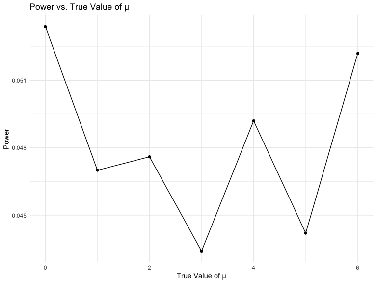
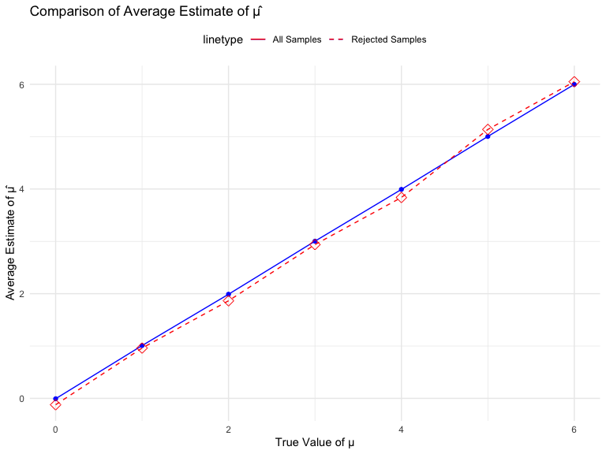

HW 5 Data Science
================
Victoria Mello (vsm2118)
November 13, 2023

## Problem 1

For this problem, we are interested in data gathered and made public by
*The Washington Post* on homicides in 50 large U.S. cities. The code
chunk below imports and cleans the data.

``` r
homicide_df = 
  read_csv("data/homicide-data.csv", na = c("", "NA", "Unknown")) %>%
  mutate(
    city_state = str_c(city, state, sep = ", "),
    resolution = case_when(
      disposition == "Closed without arrest" ~ "unsolved",
      disposition == "Open/No arrest"        ~ "unsolved",
      disposition == "Closed by arrest"      ~ "solved"
    )
  ) %>% 
  filter(city_state != "Tulsa, AL") 
```

    ## Rows: 52179 Columns: 12
    ## ── Column specification ────────────────────────────────────────────────────────
    ## Delimiter: ","
    ## chr (8): uid, victim_last, victim_first, victim_race, victim_sex, city, stat...
    ## dbl (4): reported_date, victim_age, lat, lon
    ## 
    ## ℹ Use `spec()` to retrieve the full column specification for this data.
    ## ℹ Specify the column types or set `show_col_types = FALSE` to quiet this message.

The resulting dataframe has 52178 entries, on variables that include the
victim name, race, age, and sex; the date the homicide was reported; and
the location of the homicide. In cleaning, I created a `city_state`
variable that includes both city and state, and a `resolution` variable
to indicate whether the case was closed by arrest. I also excluded one
entry in Tulsa, AL, which is not a major US city and is most likely a
data entry error.

In the next code chunk, I group within cities and summarize to produce
the total number of homicides and the number that are solved.

``` r
city_homicide_df = 
  homicide_df %>% 
  select(city_state, disposition, resolution) %>% 
  group_by(city_state) %>% 
  summarize(
    hom_total = n(),
    hom_unsolved = sum(resolution == "unsolved"))
```

Focusing only on Baltimore, MD, I can use the `prop.test` and
`broom::tidy` functions to obtain an estimate and CI of the proportion
of unsolved homicides in that city. The table below shows those values.

``` r
bmore_test = 
  prop.test(
    x = filter(city_homicide_df, city_state == "Baltimore, MD") %>% pull(hom_unsolved),
    n = filter(city_homicide_df, city_state == "Baltimore, MD") %>% pull(hom_total)) 

broom::tidy(bmore_test) %>% 
  knitr::kable(digits = 3)
```

| estimate | statistic | p.value | parameter | conf.low | conf.high | method                                               | alternative |
|---------:|----------:|--------:|----------:|---------:|----------:|:-----------------------------------------------------|:------------|
|    0.646 |   239.011 |       0 |         1 |    0.628 |     0.663 | 1-sample proportions test with continuity correction | two.sided   |

Building on this code, I can use functions in the `purrr` package to
obtain estimates and CIs for the proportion of unsolved homicides in
each city in my dataset. The code below implements this analysis.

``` r
test_results = 
  city_homicide_df %>% 
  mutate(
    prop_tests = map2(hom_unsolved, hom_total, \(x, y) prop.test(x = x, n = y)),
    tidy_tests = map(prop_tests, broom::tidy)) %>% 
  select(-prop_tests) %>% 
  unnest(tidy_tests) %>% 
  select(city_state, estimate, conf.low, conf.high) %>% 
  mutate(city_state = fct_reorder(city_state, estimate))
```

Finally, I make a plot showing the estimate (and CI) of the proportion
of unsolved homicides in each city.

``` r
test_results %>% 
  mutate(city_state = fct_reorder(city_state, estimate)) %>% 
  ggplot(aes(x = city_state, y = estimate)) + 
  geom_point() + 
  geom_errorbar(aes(ymin = conf.low, ymax = conf.high)) + 
  theme(axis.text.x = element_text(angle = 90, hjust = 1))
```


This figure suggests a very wide range in the rate at which homicides
are solved – Chicago is noticeably high and, given the narrowness of the
CI, likely is the location of many homicides.

## Problem 2

``` r
 # Step 1: Get all file names
file_names <- list.files(path = "./data", pattern = ".csv", full.names = TRUE)

# Step 2: Use purrr::map to read in data for each subject
data_list <- map(file_names, ~read_csv(.x) %>%
                   mutate(subject_id = gsub("[^0-9]", "", .x),
                          arm = ifelse(grepl("con", .x), "control", "experimental")))
```

    ## Rows: 1 Columns: 8
    ## ── Column specification ────────────────────────────────────────────────────────
    ## Delimiter: ","
    ## dbl (8): week_1, week_2, week_3, week_4, week_5, week_6, week_7, week_8
    ## 
    ## ℹ Use `spec()` to retrieve the full column specification for this data.
    ## ℹ Specify the column types or set `show_col_types = FALSE` to quiet this message.
    ## Rows: 1 Columns: 8
    ## ── Column specification ────────────────────────────────────────────────────────
    ## Delimiter: ","
    ## dbl (8): week_1, week_2, week_3, week_4, week_5, week_6, week_7, week_8
    ## 
    ## ℹ Use `spec()` to retrieve the full column specification for this data.
    ## ℹ Specify the column types or set `show_col_types = FALSE` to quiet this message.
    ## Rows: 1 Columns: 8
    ## ── Column specification ────────────────────────────────────────────────────────
    ## Delimiter: ","
    ## dbl (8): week_1, week_2, week_3, week_4, week_5, week_6, week_7, week_8
    ## 
    ## ℹ Use `spec()` to retrieve the full column specification for this data.
    ## ℹ Specify the column types or set `show_col_types = FALSE` to quiet this message.
    ## Rows: 1 Columns: 8
    ## ── Column specification ────────────────────────────────────────────────────────
    ## Delimiter: ","
    ## dbl (8): week_1, week_2, week_3, week_4, week_5, week_6, week_7, week_8
    ## 
    ## ℹ Use `spec()` to retrieve the full column specification for this data.
    ## ℹ Specify the column types or set `show_col_types = FALSE` to quiet this message.
    ## Rows: 1 Columns: 8
    ## ── Column specification ────────────────────────────────────────────────────────
    ## Delimiter: ","
    ## dbl (8): week_1, week_2, week_3, week_4, week_5, week_6, week_7, week_8
    ## 
    ## ℹ Use `spec()` to retrieve the full column specification for this data.
    ## ℹ Specify the column types or set `show_col_types = FALSE` to quiet this message.
    ## Rows: 1 Columns: 8
    ## ── Column specification ────────────────────────────────────────────────────────
    ## Delimiter: ","
    ## dbl (8): week_1, week_2, week_3, week_4, week_5, week_6, week_7, week_8
    ## 
    ## ℹ Use `spec()` to retrieve the full column specification for this data.
    ## ℹ Specify the column types or set `show_col_types = FALSE` to quiet this message.
    ## Rows: 1 Columns: 8
    ## ── Column specification ────────────────────────────────────────────────────────
    ## Delimiter: ","
    ## dbl (8): week_1, week_2, week_3, week_4, week_5, week_6, week_7, week_8
    ## 
    ## ℹ Use `spec()` to retrieve the full column specification for this data.
    ## ℹ Specify the column types or set `show_col_types = FALSE` to quiet this message.
    ## Rows: 1 Columns: 8
    ## ── Column specification ────────────────────────────────────────────────────────
    ## Delimiter: ","
    ## dbl (8): week_1, week_2, week_3, week_4, week_5, week_6, week_7, week_8
    ## 
    ## ℹ Use `spec()` to retrieve the full column specification for this data.
    ## ℹ Specify the column types or set `show_col_types = FALSE` to quiet this message.
    ## Rows: 1 Columns: 8
    ## ── Column specification ────────────────────────────────────────────────────────
    ## Delimiter: ","
    ## dbl (8): week_1, week_2, week_3, week_4, week_5, week_6, week_7, week_8
    ## 
    ## ℹ Use `spec()` to retrieve the full column specification for this data.
    ## ℹ Specify the column types or set `show_col_types = FALSE` to quiet this message.
    ## Rows: 1 Columns: 8
    ## ── Column specification ────────────────────────────────────────────────────────
    ## Delimiter: ","
    ## dbl (8): week_1, week_2, week_3, week_4, week_5, week_6, week_7, week_8
    ## 
    ## ℹ Use `spec()` to retrieve the full column specification for this data.
    ## ℹ Specify the column types or set `show_col_types = FALSE` to quiet this message.
    ## Rows: 1 Columns: 8
    ## ── Column specification ────────────────────────────────────────────────────────
    ## Delimiter: ","
    ## dbl (8): week_1, week_2, week_3, week_4, week_5, week_6, week_7, week_8
    ## 
    ## ℹ Use `spec()` to retrieve the full column specification for this data.
    ## ℹ Specify the column types or set `show_col_types = FALSE` to quiet this message.
    ## Rows: 1 Columns: 8
    ## ── Column specification ────────────────────────────────────────────────────────
    ## Delimiter: ","
    ## dbl (8): week_1, week_2, week_3, week_4, week_5, week_6, week_7, week_8
    ## 
    ## ℹ Use `spec()` to retrieve the full column specification for this data.
    ## ℹ Specify the column types or set `show_col_types = FALSE` to quiet this message.
    ## Rows: 1 Columns: 8
    ## ── Column specification ────────────────────────────────────────────────────────
    ## Delimiter: ","
    ## dbl (8): week_1, week_2, week_3, week_4, week_5, week_6, week_7, week_8
    ## 
    ## ℹ Use `spec()` to retrieve the full column specification for this data.
    ## ℹ Specify the column types or set `show_col_types = FALSE` to quiet this message.
    ## Rows: 1 Columns: 8
    ## ── Column specification ────────────────────────────────────────────────────────
    ## Delimiter: ","
    ## dbl (8): week_1, week_2, week_3, week_4, week_5, week_6, week_7, week_8
    ## 
    ## ℹ Use `spec()` to retrieve the full column specification for this data.
    ## ℹ Specify the column types or set `show_col_types = FALSE` to quiet this message.
    ## Rows: 1 Columns: 8
    ## ── Column specification ────────────────────────────────────────────────────────
    ## Delimiter: ","
    ## dbl (8): week_1, week_2, week_3, week_4, week_5, week_6, week_7, week_8
    ## 
    ## ℹ Use `spec()` to retrieve the full column specification for this data.
    ## ℹ Specify the column types or set `show_col_types = FALSE` to quiet this message.
    ## Rows: 1 Columns: 8
    ## ── Column specification ────────────────────────────────────────────────────────
    ## Delimiter: ","
    ## dbl (8): week_1, week_2, week_3, week_4, week_5, week_6, week_7, week_8
    ## 
    ## ℹ Use `spec()` to retrieve the full column specification for this data.
    ## ℹ Specify the column types or set `show_col_types = FALSE` to quiet this message.
    ## Rows: 1 Columns: 8
    ## ── Column specification ────────────────────────────────────────────────────────
    ## Delimiter: ","
    ## dbl (8): week_1, week_2, week_3, week_4, week_5, week_6, week_7, week_8
    ## 
    ## ℹ Use `spec()` to retrieve the full column specification for this data.
    ## ℹ Specify the column types or set `show_col_types = FALSE` to quiet this message.
    ## Rows: 1 Columns: 8
    ## ── Column specification ────────────────────────────────────────────────────────
    ## Delimiter: ","
    ## dbl (8): week_1, week_2, week_3, week_4, week_5, week_6, week_7, week_8
    ## 
    ## ℹ Use `spec()` to retrieve the full column specification for this data.
    ## ℹ Specify the column types or set `show_col_types = FALSE` to quiet this message.
    ## Rows: 1 Columns: 8
    ## ── Column specification ────────────────────────────────────────────────────────
    ## Delimiter: ","
    ## dbl (8): week_1, week_2, week_3, week_4, week_5, week_6, week_7, week_8
    ## 
    ## ℹ Use `spec()` to retrieve the full column specification for this data.
    ## ℹ Specify the column types or set `show_col_types = FALSE` to quiet this message.
    ## Rows: 1 Columns: 8
    ## ── Column specification ────────────────────────────────────────────────────────
    ## Delimiter: ","
    ## dbl (8): week_1, week_2, week_3, week_4, week_5, week_6, week_7, week_8
    ## 
    ## ℹ Use `spec()` to retrieve the full column specification for this data.
    ## ℹ Specify the column types or set `show_col_types = FALSE` to quiet this message.
    ## Rows: 52179 Columns: 12
    ## ── Column specification ────────────────────────────────────────────────────────
    ## Delimiter: ","
    ## chr (9): uid, victim_last, victim_first, victim_race, victim_age, victim_sex...
    ## dbl (3): reported_date, lat, lon
    ## 
    ## ℹ Use `spec()` to retrieve the full column specification for this data.
    ## ℹ Specify the column types or set `show_col_types = FALSE` to quiet this message.

``` r
# Step 3: Tidy the data
tidy_data <- bind_rows(data_list) %>% 
  filter(!is.na(subject_id) & subject_id != "") %>%
  pivot_longer(cols = starts_with("week_"), names_to = "week", values_to = "observation") %>%
  mutate(week = as.numeric(str_remove(week, "week_")))

print(unique(tidy_data$subject_id))
```

    ##  [1] "01" "02" "03" "04" "05" "06" "07" "08" "09" "10"

``` r
# Step 4: Create a spaghetti plot
study_plot <- ggplot(tidy_data, aes(x = week, y = observation, color = factor(subject_id), group = interaction(subject_id, arm))) +
  geom_line() +
  geom_point() +
  facet_wrap(~arm, scales = "free_y") + 
  labs(title = "Observation Values of Subjects in Control vs Experimental Study Arms Over 8 Weeks",
       x = "Week",
       y = "Observation Value",
       color = "Subject ID") +
  theme_minimal()

print(study_plot)
```


The control group consistently maintains observation values within the
range of roughly -2.3 to 4.3 throughout all 8 weeks, encompassing all 10
subjects. Notably, the minimum observation occurs in week 6 for subject
5, while the maximum is recorded in week 5 for subject 10. The
experimental arm exhibits a consistent positive/upward trajectory in
observation values across all subjects throughout the 8-week duration.
Subject 1 in the experimental arm records the lowest observation value
in week 1, while the peak is observed in week 9 for subject 5. This
suggests a positive correlation between observation values and time in
the experimental arm, a trend not observed in the control arm.

## Problem 3

``` r
# Set seed for reproducibility
set.seed(12345)

# Function to simulate one-sample t-test and return estimate and p-value
sim_t_test <- function(true_mean = 0, true_sd = 5, n_obs = 30) {
  x <- rnorm(n = n_obs, mean = true_mean, sd = true_sd)
  t_test_result <- broom::tidy(t.test(x))
  
  tibble(
    true_mean = true_mean,
    estimate_mean = t_test_result$estimate,
    p_value = t_test_result$p.value
  )
}

# Use map to simulate the t-test for different true values of μ
sim_results <- expand_grid(
  true_mean = c(0, 1, 2, 3, 4, 5, 6),
  iter = 1:5000
) %>% 
  mutate(t_test_results = map2(true_mean, iter, sim_t_test)) 
```

Plot 1: Power vs. True Value of μ

``` r
power_plot_data <- sim_results %>%
  mutate(power = map_dbl(t_test_results, ~ mean(.x$p_value < 0.05))) %>%
  group_by(true_mean) %>%
  summarize(power = mean(power))

ggplot(power_plot_data, aes(x = true_mean, y = power)) +
  geom_line() +
  geom_point() +  
  labs(title = "Power vs. True Value of μ",
       x = "True Value of μ",
       y = "Power")
```



There appears to be a complex, non-linear relationship between effect
size (true value of μ) and power. The initial increase from 0 to 1 and
subsequent fluctuations might suggest varying sensitivity of the test to
different effect sizes. Furthermore, the sharp changes at specific
values of μ could be indicative of thresholds or critical points where
the test’s ability to detect the effect size changes.

Plot 2: Average Estimate of μ̂ vs. True Value of μ

``` r
estimate_plot_data <- sim_results %>%
  mutate(avg_estimate = map_dbl(t_test_results, ~ mean(.x$estimate_mean))) %>%
  group_by(true_mean) %>%
  summarize(avg_estimate = mean(avg_estimate))

estimate_plot_data
```

    ## # A tibble: 7 × 2
    ##   true_mean avg_estimate
    ##       <dbl>        <dbl>
    ## 1         0        2.42 
    ## 2         1        5.01 
    ## 3         2       -5.08 
    ## 4         3        0.228
    ## 5         4        0.517
    ## 6         5       13.8  
    ## 7         6       12.1

``` r
ggplot(estimate_plot_data, aes(x = true_mean, y = avg_estimate)) +
  geom_line() +
  geom_point() + 
  labs(title = "Average Estimate of μ̂ vs. True Value of μ",
       x = "True Value of μ",
       y = "Average Estimate of μ̂")
```


Plot 3: Average Estimate of μ̂ in Rejected Samples vs. True Value of μ

``` r
rejected_estimate_plot_data <- sim_results %>%
  mutate(
    avg_estimate_rejected = map_dbl(
      t_test_results,
      ~ ifelse(mean(.x$p_value < 0.05) > 0, mean(.x$estimate_mean), NA)
    )
  ) %>%
  group_by(true_mean) %>%
  summarize(avg_estimate_rejected = mean(avg_estimate_rejected, na.rm = TRUE))

combined_data <- left_join(estimate_plot_data, rejected_estimate_plot_data, by = "true_mean")

ggplot(combined_data, aes(x = true_mean)) +
  geom_line(aes(y = avg_estimate, linetype = "All Samples"), color = "blue") +
  geom_point(aes(y = avg_estimate), color = "blue") +  
  geom_line(aes(y = avg_estimate_rejected, linetype = "Rejected Samples"), color = "red") +
  geom_point(aes(y = avg_estimate_rejected), shape = 5, size = 3, color = "red") +  
  labs(title = "Comparison of Average Estimate of μ̂",
       x = "True Value of μ",
       y = "Average Estimate of μ̂") +
  scale_linetype_manual(values = c("solid", "dashed"), labels = c("All Samples", "Rejected Samples")) +
  scale_color_manual(values = c("blue", "red")) +  
  theme_minimal() +  
  theme(legend.position = "top")  
```



The sample average of μ̂ across tests for which the null hypothesis is
rejected does not appear to be approximately equal to the true value of
μ. The average estimate of μ̂ for all samples tends to hover around a
relatively smaller range near zero, indicating unbiased behavior of the
estimator. However, the wider range observed in rejected samples
suggests increased variability, potentially influenced by factors such
as data variability and the sensitivity of the test. Notably, the
crossing points between the lines representing all samples and rejected
samples indicate that, for specific true values of μ, the estimation
process remains unbiased even when the null hypothesis is rejected. The
variability observed in rejected samples may be attributed to factors
associated with the rejection of the null hypothesis, emphasizing this
nuanced relationship between effect size, estimation, and hypothesis
testing.
